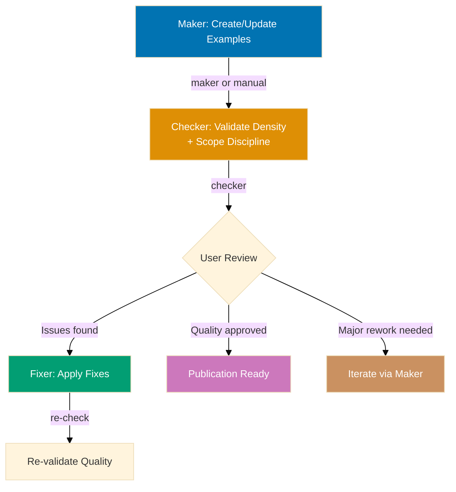

# Workflow Overview and Research Delegation

## Workflow Overview

## Research Delegation

The `apps-ayokoding-www-primer-maker` and `apps-ayokoding-www-facts-checker` agents invoked by
this workflow delegate multi-page web research to the
[`web-researcher`](../../../../.claude/agents/web/web-researcher.md) delegated agent when composing or
verifying claims about language versions, tool versions, or CLI syntax requires more than one or
two searches, or more than two fetches. In-context `WebSearch`/`WebFetch` remain available for
single-shot verification against known authoritative URLs. This keeps each agent's context lean.
The delegation is encoded in each agent's prompt — no workflow-level configuration required.
