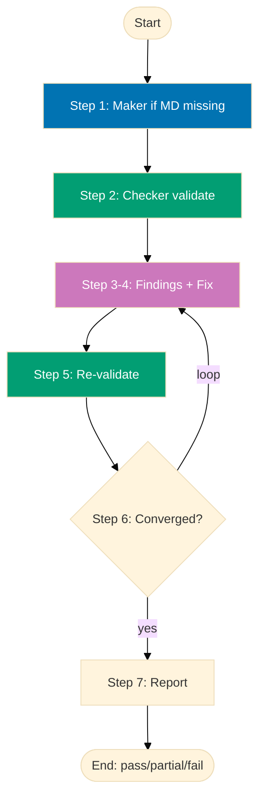

# Workflow Overview

```mermaid
%%{init: {'theme':'base', 'themeVariables': { 'fontSize':'14px'}}}%%
graph TB
    Start([Start]) --> S1[Step 1: Maker if MD missing]
    S1 --> S2[Step 2: Checker validate]
    S2 --> S34[Step 3-4: Findings + Fix]
    S34 --> S5[Step 5: Re-validate]
    S5 --> S6{Step 6: Converged?}
    S6 -->|loop| S34
    S6 -->|yes| S7[Step 7: Report]
    S7 --> End([End: pass/partial/fail])

    style S1 fill:#0173B2,color:#fff
    style S2 fill:#029E73,color:#fff
    style S5 fill:#029E73,color:#fff
    style S34 fill:#CC78BC,color:#fff
```
