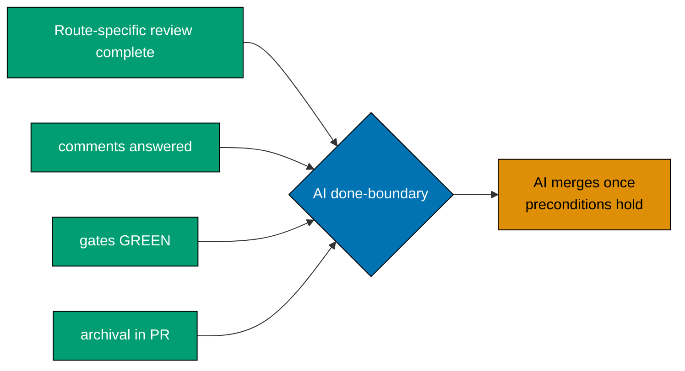

# Hardened Merge Preconditions — Notes and Merge Mechanics

> **This (a)-(e) lettering is normative.** The delivery checklists that cite these preconditions use
> the identical letters, and any future edit must change both together. An earlier revision let one
> surface run (a)-(d) while another ran (a)-(e), so both cited the same source while disagreeing about
> what (b), (c), and (d) meant. Do not emit a shortened list.

Precondition (c) is the reason a long-lived PR cannot simply be merged on the strength of a green
run from last week: the gates proved the branch was good against a `main` that has since moved.

**Merge-command mechanics are per-repo, never assumed.** Repos in this platform's family do not all
share one merge-commit convention — one may use `gh pr merge --merge` (a real 2-parent merge commit)
while another uses `--squash`, even under the same governance corpus. Verify the target repo's actual
convention (e.g., `git log --format='%P' -1 <sha>` on its last few merged PRs — 2 parents means a real
merge commit) before choosing the flag; never default to `--merge` on the assumption that it matches
another repo in the family.

The PR merge sits **outside** this workflow's done-boundary: this workflow establishes that the PR is
green and route-complete. By default `[AI]` merges immediately once the applicable done-items and the
five hardened merge preconditions hold — see
[Delivery Mode](../../../conventions/structure/plans/delivery-mode-the-four-modes.md#delivery-mode).

**Three-repo nuance**: when this workflow runs against a plan whose plan folder lives in a different
repo than the one carrying the PR (for example, a `plans/` folder that exists only in `ose-public`),
item 5 (archival-in-PR) applies only to the PR in the repo that actually carries the plan folder.
PRs in sibling repos with no plan folder use the applicable route requirements plus items 3–4.
