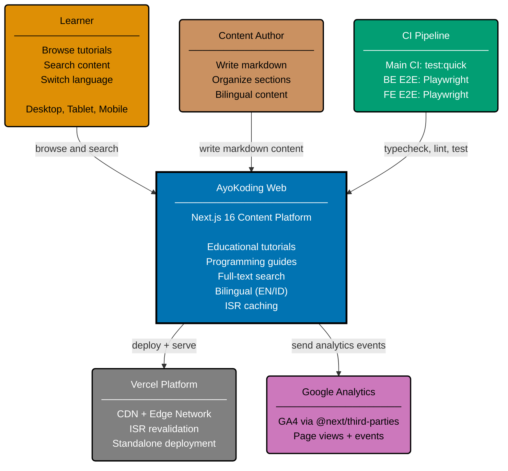

# Context Diagram: AyoKoding Web

Level 1 of the C4 model. Shows the AyoKoding Web platform as a single system with its external
actors. The system is a Next.js 16 fullstack content platform that serves bilingual educational
content (English and Indonesian) for developers.

## Actors

| Actor            | Role                                                                   |
| ---------------- | ---------------------------------------------------------------------- |
| Learner          | Browses tutorials, searches content, switches between EN/ID            |
| Content Author   | Creates markdown content with YAML frontmatter in `content/` directory |
| CI Pipeline      | Runs typecheck, lint, unit tests, BE/FE E2E tests via Playwright       |
| Vercel           | Hosts the production deployment with ISR and CDN edge caching          |
| Google Analytics | Collects page view and event data via GA4 (`@next/third-parties`)      |

## Related

- **Container diagram**: [../containers/container.md](../containers/container.md)
- **API perspective component diagram**: [../components/api/component-api.md](../components/api/component-api.md)
- **Web perspective component diagram**: [../components/web/component-web.md](../components/web/component-web.md)
- **Parent**: [ayokoding specs](../README.md)
