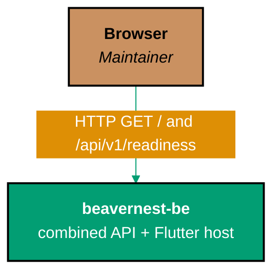

# BeaverNest — System Context (C4 L1)

The foundation has exactly one human actor and one same-origin internal call, no external systems or
third-party integrations. Production is a single combined `beavernest-be` runtime; Flutter Web is
built into its static assets and has no standalone development server.

`beavernest-be` serves the pre-built `beavernest-app` static assets same-origin from port 19300.
The browser talks to one combined runtime, and `beavernest-app` calls its relative API routes.

## Actors

- **Maintainer (browser)** — the only human actor. Navigates to the `beavernest-app` Flutter Web
  workspace through the combined `beavernest-be` runtime; there is no authentication and no other
  user role.

## Systems

- **`beavernest-app`** — Flutter Web client. Renders the Foundation status workspace, refreshes
  readiness in place, and displays contract-safe diagnostics. Its pre-built assets are served
  statically by `beavernest-be`.
- **`beavernest-be`** — F#/Giraffe REST API backed by SQLite. Exposes `GET /api/v1/health`
  (liveness), `GET /api/v1/readiness` (database/schema readiness, the call `beavernest-app`
  makes), and a 404 handler for any other route — including the retired `/api/v1/hello` greeting
  route. In production it is the single combined runtime, also serving the frontend's static assets
  same-origin on port 19300.

## External Systems

None. Phase 1 is deliberately self-contained — no third-party API, no auth provider. SQLite is an
embedded, in-process store, not an external system.

## Related

- [context.md](./context.md) — C4 L1 detail (see this README)
- [product/](../product/README.md) — foundation scope
- [containers/](../containers/README.md) — C4 L2 deployable units
- [behavior/](../behavior/README.md) — Gherkin scenarios covering both HTTP calls above
