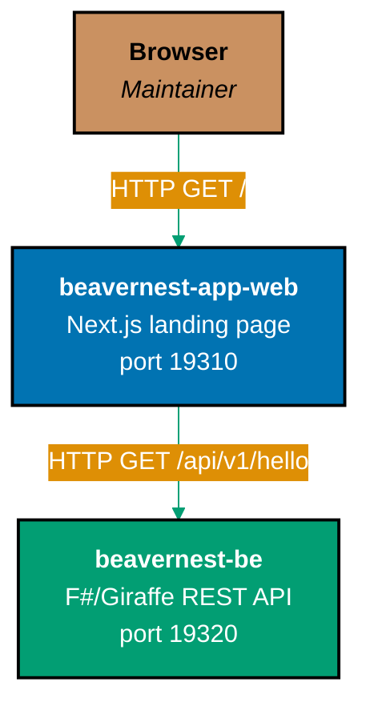

# BeaverNest — System Context (C4 L1)

The Phase 1 hello-world quad has exactly one human actor and one internal call, no external
systems or third-party integrations.

## Actors

- **Maintainer (browser)** — the only human actor in Phase 1. Navigates to `beavernest-app-web` in a
  browser; there is no authentication and no other user role.

## Systems

- **`beavernest-app-web`** — Next.js 16 landing page. Renders one page (`/`) that names the product and
  displays the greeting it fetches from `beavernest-be`.
- **`beavernest-be`** — stateless F#/Giraffe REST API. Exposes `GET /api/v1/health` (liveness),
  `GET /api/v1/hello` (the greeting `beavernest-app-web` renders), and a 404 handler for any other route.

## External Systems

None. Phase 1 is deliberately self-contained — no database, no third-party API, no auth provider.

## Related

- [context.md](./context.md) — C4 L1 detail (see this README)
- [product/](../product/README.md) — hello-world scope
- [containers/](../containers/README.md) — C4 L2 deployable units
- [behavior/](../behavior/README.md) — Gherkin scenarios covering both HTTP calls above
