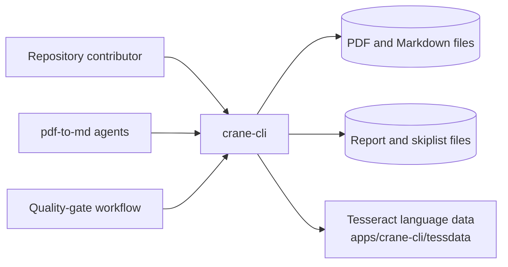
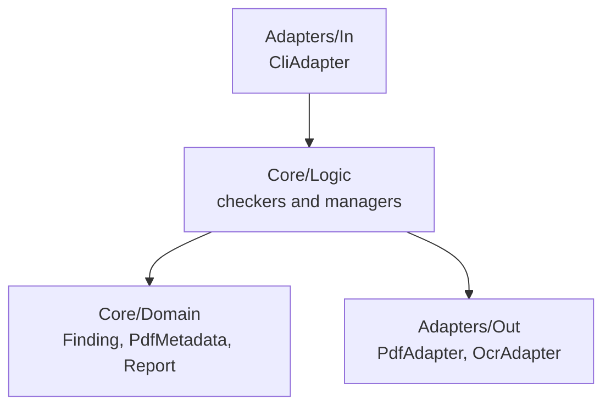

# Crane CLI — Architecture

The current, as-built system. A change that alters an actor, a container, a component
responsibility, a relationship, or a boundary updates this document in the same delivery unit.

## Scope

`crane-cli` turns a PDF into dependable Markdown evidence. It extracts text, tables, figures, and
OCR output, then checks headings, nesting, Mermaid syntax, and OCR quality, and records the result
in a report. Everything runs locally against files on disk; the tool never reaches the network.

## System Context

Three callers share one argv grammar and one JSON output shape. The agents are the reason the
output is JSON rather than prose: a caller parses it, so a field name is part of the contract.

## Containers

| Container                 | What it is                                 | How it is reached                   |
| ------------------------- | ------------------------------------------ | ----------------------------------- |
| `crane-cli`               | one .NET 10 executable                     | `nx run crane-cli:run -- <command>` |
| `apps/crane-cli/tessdata` | Tesseract language data the OCR path loads | read from disk at OCR time          |

## Components

Crane is ports-and-adapters. The core holds the rules; the adapters hold everything that touches
the outside world.

| Component      | Responsibility                                                                               |
| -------------- | -------------------------------------------------------------------------------------------- |
| `Core/Domain`  | the finding, the PDF metadata record, and the report — the vocabulary every check reports in |
| `Core/Logic`   | one module per check: text, heading, nesting, table, figure, Mermaid, OCR, report, skiplist  |
| `Adapters/In`  | the argv surface — parsing, dispatch, and JSON rendering                                     |
| `Adapters/Out` | PDF extraction and OCR, the two places a real external tool is invoked                       |

`PdfExtractionCache` sits in `Core/Logic` rather than in the PDF adapter: extraction is expensive
and several checks read the same document, so the cache is a rule about how often the adapter is
called, not part of the adapter itself.

## Constraints

**JSON output is a contract.** A command's stdout shape is consumed by agents. Renaming or removing
a field is a breaking change and needs a scenario change in the same delivery unit.

**The core never touches the filesystem directly.** Every read of a PDF or a language-data file goes
through `Adapters/Out`, which is what lets the unit suite exercise the checkers in memory.

**No network.** Extraction, OCR, and validation are entirely local; a machine without connectivity
runs the whole tool.

## Related

- [Behaviors](./behaviors/README.md) — the scenarios this system must satisfy.
- [`apps/crane-cli/README.md`](../../../../apps/crane-cli/README.md) — the implementing project.
