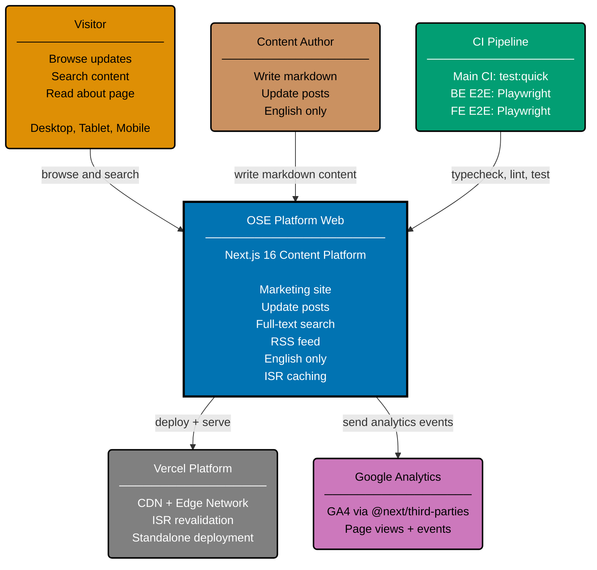

# OSE — System Context Diagrams (C4 L1)

## OSE Application (`ose-app-*`)

### Actors

| Actor              | Role                                                         |
| ------------------ | ------------------------------------------------------------ |
| Compliance Officer | Uploads regulatory and policy documents; reviews gap reports |
| Risk Team Member   | Reviews and triages GapItem records                          |

### External Systems

| System                    | Purpose                                      |
| ------------------------- | -------------------------------------------- |
| Regulator Document Store  | Source of regulator-published rule documents |
| LLM Provider (OpenRouter) | AI inference for gap analysis prompts        |

## OSE Platform Web (`ose-web`)

### Actors

| Actor            | Role                                                                   |
| ---------------- | ---------------------------------------------------------------------- |
| Visitor          | Browses updates, searches content, reads about page                    |
| Content Author   | Creates markdown content with YAML frontmatter in `content/` directory |
| CI Pipeline      | Runs typecheck, lint, unit tests, BE/FE E2E tests via Playwright       |
| Vercel           | Hosts the production deployment with ISR and CDN edge caching          |
| Google Analytics | Collects page view and event data via GA4 (`@next/third-parties`)      |

## Related

- **Container diagram**: [container.md](../containers/container.md)
- **Parent**: [ose specs](../README.md)
