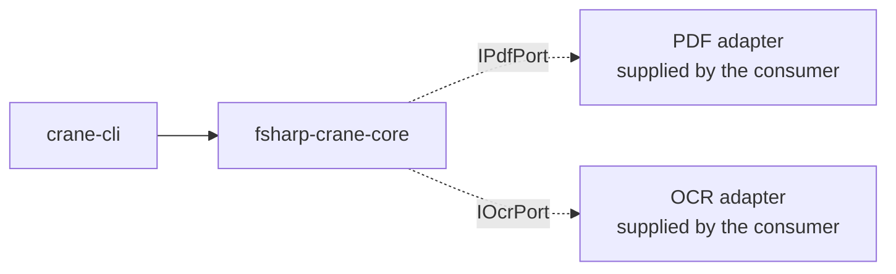

# fsharp-crane-core — Architecture

The current, as-built library. A change that alters a port, a consumer relationship, or the
extraction-path decision updates this document in the same delivery unit.

## Scope

`fsharp-crane-core` is the shared F# domain and logic core for PDF-to-Markdown conversion. It owns
the vocabulary — `PdfMetadata`, `Finding` — and the decision about which extraction path a document
takes. It performs no I/O itself.

## Consuming Boundary

The core declares two ports and the consumer supplies both. Nothing in this library opens a file,
which is what lets its scenarios run entirely in memory against stub ports.

## Components

| Module               | Responsibility                                                               |
| -------------------- | ---------------------------------------------------------------------------- |
| `Core/Ports`         | `IPdfPort`, `IOcrPort`, and the function aliases for read, write, and append |
| `Domain/PdfMetadata` | what the core knows about a document                                         |
| `Domain/Finding`     | the single shape every check reports in                                      |
| `Convert`            | the conversion walk-skeleton: sample, decide, then extract or OCR            |

## The Extraction-Path Decision

`convertPdfToMarkdown` samples three pages and counts words. More than ten words means the document
carries a real text layer and goes to `ExtractPages`; ten or fewer means it is effectively an image
and goes to `ExtractText` through OCR.

That threshold is a judgment, not a derived constant, and it is the library's one behavioral
decision — which is why it belongs in a scenario rather than only in the code.

## Constraints

**Every failure is a `Result`, never an exception.** Both ports return `Result<_, string>`, and the
core propagates rather than throws, so a consumer decides how a failed extraction is reported.

**The core has no adapter dependency.** Adding a reference from this library to a concrete PDF or
OCR implementation would make the in-memory scenarios impossible and move the decision out of the
place that owns it.

## Related

- [Behaviors](./behaviors/README.md) — the scenarios this library must satisfy.
- [`libs/fsharp-crane-core/project.json`](../../../libs/fsharp-crane-core/project.json) — the
  implementing project.
- [`specs/apps/crane/cli`](../../apps/crane/cli/README.md) — the consumer that supplies both ports.
